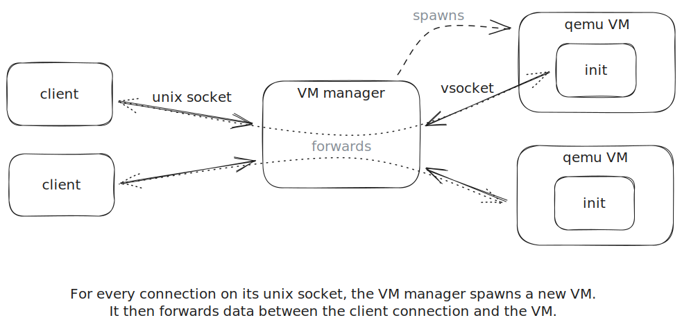

# Tiny Test Machines

I use this program to launch tiny qemu/kvm virtual machines for testing kernel modules.



## Usage

First, build the guest system (see below for dependencies):

```shell
./build
```

Then run the VM Manager:

```shell
go run .
```

Or, if you just want a VM with an interactive shell:

```shell
./run
```

## Dependencies

For building:
* Go.
* Build dependencies of the Linux kernel.

For running:
* Qemu installed.
* KVM support.
* vhost-vsocket kernel support.
